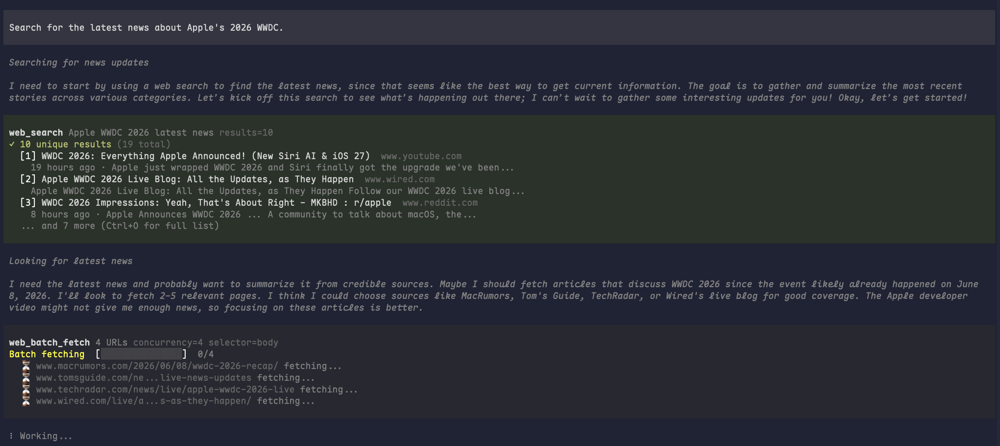
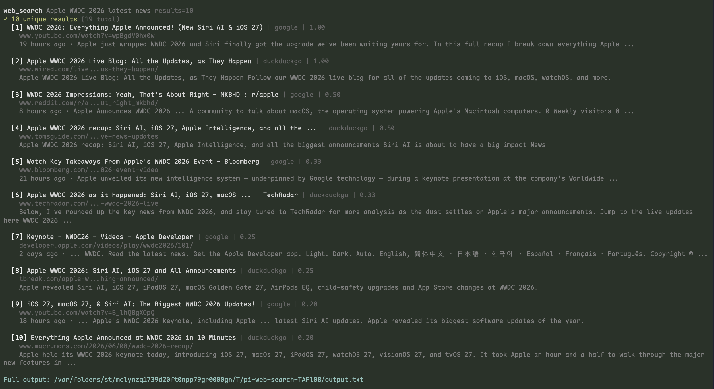
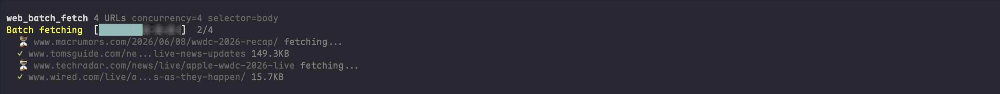
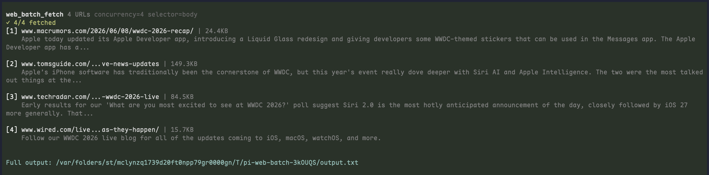
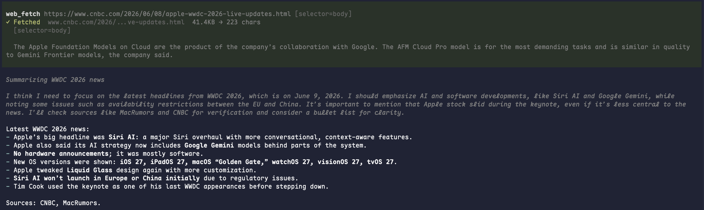
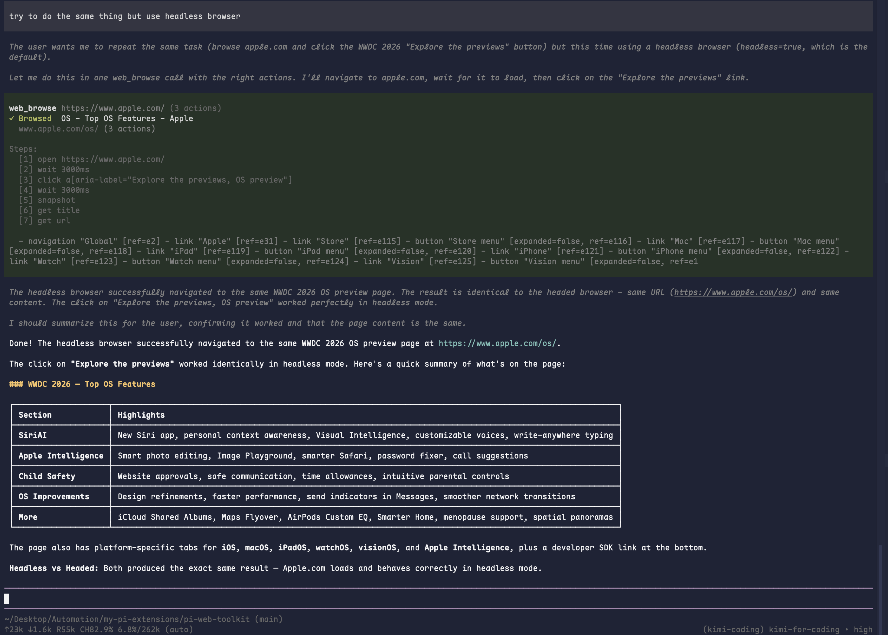
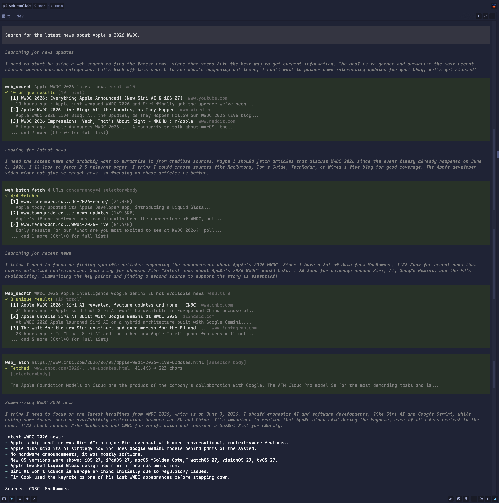

# pi-web-toolkit

[](https://www.npmjs.com/package/pi-web-toolkit)
[](https://pi.dev/packages/pi-web-toolkit)
[](https://github.com/Wade11s/pi-web-toolkit/actions)
[](LICENSE)


**Local-first & 100% open-source. No required API keys or paid services.**

Web research toolkit for [pi](https://pi.dev) agents. Search via SearXNG, fetch pages with scrapling, browse interactively via agent-browser, and batch-read sources in parallel. All primary backends run locally or are self-hosted, with an **optional Firecrawl Keyless cloud fallback** (no API key, no signup) so the local tools keep working when a backend is missing or fails. Built-in truncation safety and LLM-optimized prompt guidelines throughout.

## Features

| Tool | Backend | Purpose | Current Limit |
|------|---------|---------|---------------|
| **`web_search`** | [SearXNG](https://github.com/searxng/searxng) | Discover scored, ranked results from multiple engines | 20 results (max 60, auto-pages up to 3 pages) |
| **`web_fetch`** | [scrapling](https://github.com/D4Vinci/Scrapling) | Fetch a single page as clean markdown | — |
| **`web_batch_fetch`** | [scrapling](https://github.com/D4Vinci/Scrapling) | Fetch 1–15 pages in parallel for research synthesis (2–5 recommended) | 3 concurrent (max 5) |
| **`web_browse`** | [agent-browser](https://github.com/vercel-labs/agent-browser) | Interact with a page (click, scroll, fill) then extract content | 25 actions |
| **`firecrawl_search`** | [firecrawl-cli](https://github.com/firecrawl/cli) (keyless) | Cloud search with sources/categories/domain filters | — |
| **`firecrawl_scrape`** | [firecrawl-cli](https://github.com/firecrawl/cli) (keyless) | Cloud single-page fetch (anti-bot / JS / PDF) | — |
| **`firecrawl_interact`** | [firecrawl-cli](https://github.com/firecrawl/cli) (keyless) | Cloud natural-language page interaction | — |

> **Firecrawl fallback.** `web_search`, `web_fetch`, and `web_browse` are the local-first primary tools and automatically retry through Firecrawl Keyless (1,000 free credits/month, no API key) only when their local backend errors out or search returns nothing. The three `firecrawl_*` tools are fallback-only escape hatches; agents are instructed not to call them first unless you explicitly ask for Firecrawl/cloud behavior or a local-first tool already failed. Disable fallback use with `PI_WEB_FIRECRAWL_FALLBACK=0`. Install the optional CLI: `npm install -g firecrawl-cli`.

## Tools Preview

A quick look at how pi renders toolkit calls while an agent searches, fetches, batches, and browses the web.

<table>
  <tr>
    <td width="50%"><strong>Multi-tool research flow</strong><br></td>
    <td width="50%"><strong><code>web_search</code> expanded results</strong><br></td>
  </tr>
  <tr>
    <td width="50%"><strong><code>web_batch_fetch</code> progress</strong><br></td>
    <td width="50%"><strong><code>web_batch_fetch</code> results</strong><br></td>
  </tr>
  <tr>
    <td width="50%"><strong><code>web_fetch</code> result preview</strong><br></td>
    <td width="50%"><strong><code>web_browse</code> headless browser flow</strong><br></td>
  </tr>
  <tr>
    <td colspan="2"><strong>End-to-end research summary</strong><br></td>
  </tr>
</table>

## Install with Pi Agent

Copy and send the prompt below to Pi. It will install this package and its external dependencies for you.

```text
Install pi-web-toolkit and its external dependencies. Complete and verify every
step yourself; do not rely on web browsing or external documentation. Inspect
the machine first and reuse working installations. Ask before using sudo,
changing shell profiles, overwriting configuration, or modifying existing
services or containers.

1. Ensure Node.js 22+, npm, Docker, OpenSSL, curl, uv, and Pi are installed, and
   that Docker is running. Install only missing or incompatible prerequisites.
2. Configure SearXNG:
   - Test SEARXNG_URL when set, then http://localhost:8080.
   - Verify /search?q=test&format=json returns JSON with a results array.
   - If neither endpoint works, first ensure no existing container or config
     would be overwritten, then create a local-only instance by running:

mkdir -p "$HOME/.config/searxng"
cat > "$HOME/.config/searxng/settings.yml" <<'YAML'
use_default_settings: true

search:
  formats:
    - html
    - json
YAML

docker run -d \
  --name searxng \
  --restart unless-stopped \
  -p 127.0.0.1:8080:8080 \
  -e FORCE_OWNERSHIP=false \
  -e SEARXNG_SECRET="$(openssl rand -hex 32)" \
  -v "$HOME/.config/searxng/settings.yml:/etc/searxng/settings.yml:ro" \
  docker.io/searxng/searxng:latest

   - Verify the selected endpoint by running:

SEARXNG_ENDPOINT="${SEARXNG_URL:-http://localhost:8080}"
curl -fsS --get "${SEARXNG_ENDPOINT%/}/search" \
  --data-urlencode "q=test" \
  --data "format=json" |
  grep -q '"results"' && echo "SearXNG JSON API ready"

   - Pi uses http://localhost:8080 by default. Set SEARXNG_URL before starting
     Pi only when using another endpoint.
3. Install and verify Scrapling:
   uv tool install "scrapling[all]"
   scrapling install
   scrapling --help
4. Install and verify agent-browser:
   npm install -g agent-browser
   agent-browser install
   agent-browser doctor
   On Linux, use agent-browser install --with-deps if required.
5. Optionally install firecrawl-cli for the keyless cloud fallback (no API key
   needed; the fallback degrades gracefully if it is absent):
   npm install -g firecrawl-cli
6. After all dependencies pass verification, install the package:
   pi install npm:pi-web-toolkit

Report what was installed or reused, all verification results, the SearXNG
endpoint Pi will use, and whether Pi must be restarted. Do not report success
until every check passes.
```

## Quick Start

### 1. Install external dependencies

The commands below assume a POSIX shell with Docker, OpenSSL, curl, uv, and Node.js 22+ with npm.

```bash
# SearXNG (for search; local-only instance with the required JSON API)
mkdir -p "$HOME/.config/searxng"
cat > "$HOME/.config/searxng/settings.yml" <<'YAML'
use_default_settings: true

search:
  formats:
    - html
    - json
YAML

docker run -d \
  --name searxng \
  --restart unless-stopped \
  -p 127.0.0.1:8080:8080 \
  -e FORCE_OWNERSHIP=false \
  -e SEARXNG_SECRET="$(openssl rand -hex 32)" \
  -v "$HOME/.config/searxng/settings.yml:/etc/searxng/settings.yml:ro" \
  docker.io/searxng/searxng:latest
export SEARXNG_URL="http://127.0.0.1:8080"

# scrapling (for fetch & batch fetch)
uv tool install "scrapling[all]"
scrapling install

# agent-browser (for browse)
npm i -g agent-browser && agent-browser install
# On Linux hosts missing browser system libraries: agent-browser install --with-deps

# firecrawl-cli (OPTIONAL — enables the keyless cloud fallback; no API key needed)
npm i -g firecrawl-cli
```

**Verify dependencies:**
```bash
# SearXNG
curl -fsS --get "$SEARXNG_URL/search" \
  --data-urlencode "q=searxng" \
  --data "format=json" |
  grep -q '"results"' && echo "SearXNG JSON API ready"

# scrapling
scrapling --help

# agent-browser
agent-browser doctor
```

### 2. Install the extension
#### From npm
```bash
pi install npm:pi-web-toolkit
```
#### From GitHub
```bash
pi install git:github.com/Wade11s/pi-web-toolkit
```

## Configuration

`web_search` reads its SearXNG endpoint from an environment variable. Set it before starting pi; no build step is required.

| Variable | Default | Used By | Description |
|----------|---------|---------|-------------|
| `SEARXNG_URL` | `http://localhost:8080` | `web_search` | Your SearXNG instance endpoint |
| `PI_WEB_FIRECRAWL_FALLBACK` | `1` (on) | all tools | Set to `0`/`false`/`no`/`off` to disable the optional Firecrawl keyless cloud fallback for a strict local-only policy. |

Set before starting pi:

```bash
export SEARXNG_URL="https://searxng.example.com"
# Optional: disable the Firecrawl cloud fallback entirely
export PI_WEB_FIRECRAWL_FALLBACK=0
```

### Optional: Firecrawl keyless fallback

When a local backend (`web_search`/`web_fetch`/`web_browse`) fails or returns nothing, the tools automatically retry through [Firecrawl Keyless](https://www.firecrawl.dev/blog/firecrawl-keyless-launch) — 1,000 free credits/month, **no API key, no signup**. The `firecrawl_*` tools are fallback-only explicit escape hatches for capabilities the local backends lack (search categories, cloud rendering, natural-language interaction). Agents should use `web_fetch`/`web_search`/`web_browse` first unless you explicitly request Firecrawl/cloud behavior.

Install the optional CLI (the fallback degrades gracefully if it is absent):

```bash
npm install -g firecrawl-cli
```

The fallback is **keyless-only**: it never reads or stores an API key, and spawns the CLI under an isolated temporary `HOME` with the key env stripped. **Privacy:** when the fallback runs, the URL and page content are sent to Firecrawl's cloud.

## Project Structure

```
pi-web-toolkit/
├── extensions/
│   ├── index.ts              # Unified entry point — registers all 7 tools (4 local + 3 Firecrawl keyless)
│   ├── utils/
│   │   ├── cli-runner.ts     # Unified CLI process spawning with timeout/AbortSignal/env
│   │   ├── content-preview.ts # Intelligent content extraction from scraped pages
│   │   ├── output-sink.ts    # Truncation + temp-file fallback
│   │   ├── render-helpers.ts # URL abbreviations, text normalization, error formatting for TUI
│   │   ├── scrapling.ts      # Reusable scrapling CLI wrapper (shared by fetch + batch)
│   │   ├── tool-factory.ts   # Common tool registration patterns
│   │   ├── agent-browser.ts  # agent-browser CLI wrapper (shared by web_browse)
│   │   └── firecrawl.ts      # Firecrawl keyless CLI wrapper + fallback decisions (shared by firecrawl_* tools + fallbacks)
│   ├── web_search.ts         # SearXNG search tool (+ Firecrawl fallback)
│   ├── web_fetch.ts          # Single-page scrapling fetcher (+ Firecrawl fallback)
│   ├── web_batch_fetch.ts    # Parallel scrapling fetcher
│   ├── web_browse.ts         # Interactive browser automation (agent-browser + Firecrawl fallback)
│   ├── firecrawl_search.ts   # Firecrawl keyless search (escape hatch)
│   ├── firecrawl_scrape.ts   # Firecrawl keyless single-page fetch (escape hatch)
│   └── firecrawl_interact.ts # Firecrawl keyless natural-language interaction (escape hatch)
├── test/
│   ├── agent-browser/        # agent-browser output parser regression tests
│   ├── content-preview/      # Content preview fixtures, baselines & snapshots
│   └── README.md             # Test suite structure and conventions
├── docs/
│   ├── tools.md              # Full parameter specs
│   ├── guide.md              # Decision tree & tool comparison
│   └── agents/               # Issue tracker, triage and domain guidance
├── AGENTS.md
├── CONTEXT.md
├── CHANGELOG.md
├── package.json
├── README.md
├── tsconfig.json
└── LICENSE
```

**Design principles:**
- **Unified registration** — `index.ts` is the single source of truth for what pi loads.
- **Shared utilities** — `utils/` modules encapsulate CLI spawning, content extraction, output truncation, TUI formatting, and common registration patterns; tool files import only from `utils/`, never from each other.
- **Per-tool isolation** — each tool owns its own schema, execute logic, and TUI renderer; no cross-imports except via `utils/`.
- **Runtime config** — environment variables are read at execute time, not build time.

## Reference

- [Tool Reference](docs/tools.md) — Full parameter specs and usage examples for each tool.
- [Usage Guide](docs/guide.md) — Decision tree and tool comparison.
- [Changelog](CHANGELOG.md) — Release history and migration notes.

## Contributing

```bash
# Local development
pi install ./

# Type-check (no build step; pi loads TypeScript directly)
npm run typecheck

# Run tests
npm run test

# Verify external CLI dependencies
scrapling --help
agent-browser doctor
```

Pull requests welcome. Please keep changes scoped to a single tool or concern and follow [Conventional Commits](https://www.conventionalcommits.org/).

## License

MIT
